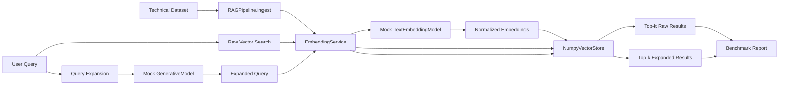

# Context-Aware Retrieval Engine: Software Design

## Purpose

This project implements a local Retrieval-Augmented Generation (RAG) and vector-search pipeline. It compares two retrieval strategies:

- **Strategy A:** embed the raw user query and search directly.
- **Strategy B:** use a mocked AI model to expand the query, then embed and search.

The implementation is local and deterministic so it can run without Google Cloud credentials, Vertex AI access, or external model downloads.

## Architecture



## Components

### `RAGPipeline`

Coordinates ingestion, raw retrieval, AI-enhanced retrieval, and benchmark comparison.

### `EmbeddingService`

Wraps the mocked Vertex-style embedding model and normalizes vectors before storage or search.

### `TextEmbeddingModel` mock

Simulates `vertexai.language_models.TextEmbeddingModel` using deterministic local feature hashing.

### `GenerativeModel` mock

Simulates query rewriting and expansion for better semantic search.

### `NumpyVectorStore`

Stores vectors in memory and performs top-k cosine-similarity search.

### `benchmark.py`

Runs three complex queries and writes `retrieval_benchmark.md`.

## Similarity Metric

The project uses cosine similarity. Embeddings are L2-normalized, so cosine similarity can be computed as a dot product. This is appropriate for semantic embeddings because direction usually matters more than vector magnitude.

## Production Migration

To migrate to Vertex AI Vector Search:

1. Replace the mock embedding class with Vertex AI embeddings.
2. Generate embeddings for production document chunks.
3. Store metadata and access-control data separately.
4. Create a Vertex AI Vector Search Matching Engine index.
5. Deploy the index to an endpoint.
6. Replace `NumpyVectorStore.search` with Vertex AI index queries.
7. Replace the mocked generative model with Gemini query expansion.
8. Preserve top-k behavior, tenant filtering, ACL checks, and benchmark evaluation.

## Validation

Run:

```powershell
python -m rag_engine.benchmark
python -m pytest -q
```
